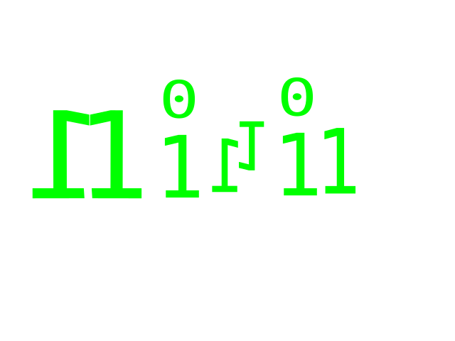

<p align="center">
  
</p>

<p align="center">
  <i>minimal runtime, maximal control</i>
</p>

<p align="center">
  
  
  
  
  
  
  <a href="https://creativecommons.org/publicdomain/zero/1.0/">
  
  
</p>

**minil** is a minimal Linux user‑space runtime written in pure assembly and
freestanding C.  
It runs **without glibc, CRT objects, standard libraries (`stdio.h`, `stdlib.h`), or any C++ runtime**.

The project demonstrates full control over the Linux process entry point,
ABI, and system calls.

---

<h2 align="center">Features</h2>

- Custom `_start` (no `crt1.o`)
- No glibc / libc / libgcc / libstdc++
- Direct Linux syscalls
  - x86‑64: `syscall`
  - i386: `int 0x80`
- Manual `argc`, `argv`, `envp` extraction
- Proper `environ` initialization
- One `.S` file with C preprocessor for multi‑arch
- `.init_array` constructor support
- Freestanding C/C++ application support

---

<h2 align="center">How It Works</h2>

1. Linux kernel jumps to `_start`
2. `_start` reads `argc`, `argv`, `envp` from stack
3. .init_array execution
4. Global `environ` is set manually
5. `main()` is called directly
6. Process exits via `_exit` syscall

<h2 align="center">Why?</h2>

Most Linux applications rely on multiple runtime layers before
`main()` is reached.

minil removes those layers and exposes the Linux process model directly,
making every transition from kernel to user space explicit.

---

<h2 align="center">Runtime Components</h2>

minil provides:

- process startup (_start)
- argc / argv / envp initialization
- environ support
- direct Linux syscalls
- memory allocator (malloc/free/realloc/calloc)
- memory mapping (mmap/munmap)
- string and memory functions
- snprintf()
- basic C++ runtime support

---

<h2 align="center">Build</h2>

Single‑command build (recommended):

```bash
gcc -nostdlib -fno-pie -fcf-protection=none -no-pie minil.S app.c -O2 -ffreestanding -o app
```

<h3 align="center">32‑bit (i386)</h3>

```bash
gcc -m32 -fno-pie -fcf-protection=none -nostdlib -no-pie minil.S app.c -O2 -ffreestanding -o app32
```

---

<h2 align="center">Example <pre>app.c</pre></h2>

```c
long write(int, const void*, unsigned long);
void _exit(int);

int main(void) {
#if defined(__x86_64__)
    const char msg[] = "Hello from 64 bit minil\n";
#else
    const char msg[] = "Hello from 32 bit minil\n";
#endif
    write(1, msg, sizeof(msg) - 1);
    _exit(0);
}
```

---

<h2 align="center">Use Cases</h2>

- Minimal ELF utilities
- Learning Linux ABI and process startup
- Security research / exploit development
- OS and runtime development
- libc‑free sandboxed tools


<h2 align="center">Philosophy</h2>

minil follows a simple rule:

> no hidden runtime, no implicit initialization, no abstraction over syscalls.

<h2 align="center">Supported Architectures</h2>

- x86_64
- i386
- AArch64
- RISC-V

<p align="right">
  <a href="https://creativecommons.org/publicdomain/zero/1.0/">
    
  </a>
</p>

`#define MINIL_SIGNATURE 0x1DB`
